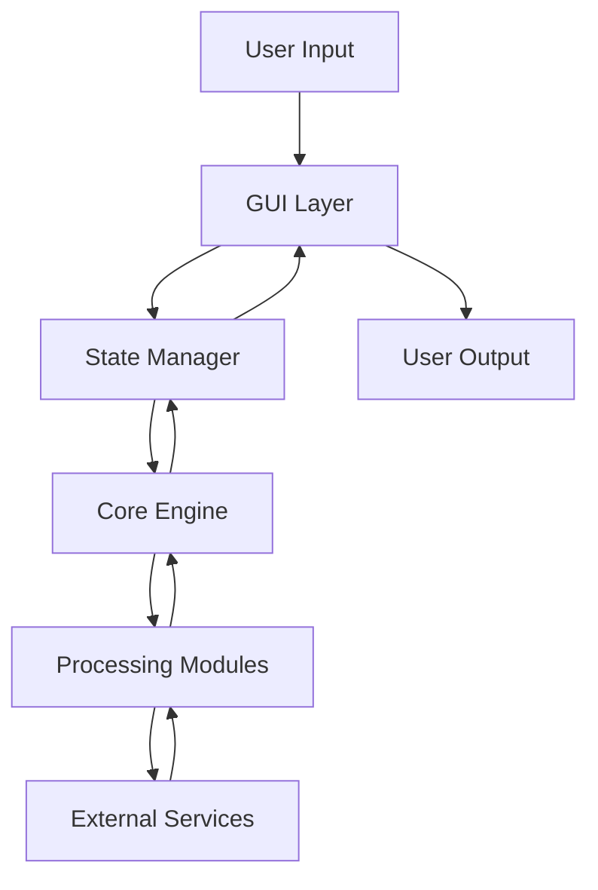

# Akashic Scribe Developer Guide

**VoidCat RDC - Excellence in Software Architecture**

This comprehensive guide provides detailed information for developers who want to contribute to, extend, or integrate with Akashic Scribe.

## Table of Contents

- [Architecture Overview](#architecture-overview)
- [Project Structure](#project-structure)
- [Development Environment Setup](#development-environment-setup)
- [Building and Testing](#building-and-testing)
- [Code Standards and Conventions](#code-standards-and-conventions)
- [Core Components](#core-components)
- [Adding New Features](#adding-new-features)
- [Testing Framework](#testing-framework)
- [Continuous Integration](#continuous-integration)
- [Contributing Guidelines](#contributing-guidelines)
- [API Integration](#api-integration)
- [Extension Development](#extension-development)
- [Performance Optimization](#performance-optimization)
- [Security Considerations](#security-considerations)
- [Deployment and Distribution](#deployment-and-distribution)

## Architecture Overview

Akashic Scribe follows VoidCat RDC's clean architecture principles with strict separation of concerns and maintainable, testable code.

### Architectural Principles

1. **Separation of Concerns**: Clear boundaries between UI, business logic, and data layers
2. **Dependency Inversion**: High-level modules do not depend on low-level modules
3. **Interface Segregation**: Clients depend only on interfaces they use
4. **Single Responsibility**: Each component has one reason to change
5. **Open/Closed Principle**: Open for extension, closed for modification

### Core Components

#### 1. GUI Layer (Presentation)

- **Technology**: Fyne toolkit v2
- **Responsibility**: User interaction and presentation logic
- **Key Files**: `gui/layout.go`, `gui/state.go`, `gui/theme.go`
- **Pattern**: Model-View-Presenter (MVP)

#### 2. Core Engine (Business Logic)

- **Technology**: Pure Go interfaces and implementations
- **Responsibility**: Transcription, translation, and dubbing operations
- **Key Files**: `core/engine.go`, `core/real_engine.go`, `core/mock_engine.go`
- **Pattern**: Strategy and Factory patterns

#### 3. State Management

- **Technology**: Centralized state with observer pattern
- **Responsibility**: Application state coordination
- **Key Files**: `core/options.go`, `gui/state.go`
- **Pattern**: Observer and Command patterns

### Data Flow Architecture



### Component Interaction

1. **User interacts** with GUI components
2. **GUI updates** centralized state via ScribeOptions
3. **State changes** trigger appropriate business logic
4. **Core Engine** processes requests using strategy pattern
5. **Results** flow back through the same path for display

## Project Structure

```
akashic_scribe/
├── main.go                     # Application entry point and initialization
├── go.mod                      # Go module definition and dependencies
├── go.sum                      # Dependency checksums
├── FyneApp.toml               # Fyne application metadata
│
├── core/                       # Business logic layer
│   ├── engine.go              # Core engine interface definitions
│   ├── real_engine.go         # Production implementation
│   ├── mock_engine.go         # Testing implementation
│   ├── options.go             # Configuration and state structures
│   ├── integration_test.go    # Integration testing
│   └── mock_engine_test.go    # Unit tests for mock engine
│
├── gui/                        # Presentation layer
│   ├── layout.go              # UI layout and component composition
│   ├── state.go               # GUI state management
│   ├── theme.go               # Custom theme implementation
│   ├── engine.go              # GUI-Core interface adapter
│   └── gui_e2e_test.go        # End-to-end GUI tests
│
├── assets/                     # Static resources
│   ├── icons/                 # Application icons
│   ├── fonts/                 # Custom fonts
│   └── README.md              # Asset documentation
│
├── tests/                      # Testing utilities
│   ├── e2e_test.go           # Application-level E2E tests
│   └── test_state.go         # Test state management
│
├── docs/                       # Documentation
│   ├── images/                # Documentation images
│   └── diagrams/              # Architecture diagrams
│
└── scripts/                    # Build and deployment scripts
    ├── build.sh               # Cross-platform build script
    ├── test.sh                # Comprehensive test runner
    └── package.sh             # Distribution packaging
```

### Key Design Patterns

#### 1. Interface Segregation

```go
// ScribeEngine - Main processing interface
type ScribeEngine interface {
    Transcribe(videoSource string) (string, error)
    Translate(text, targetLanguage string) (string, error)
    GenerateSubtitles(transcription, translation string, options *ScribeOptions) (string, error)
    GenerateDubbing(translation, voiceModel string, options *ScribeOptions) (string, error)
    StartProcessing(options *ScribeOptions, progressChan chan<- float64) (string, error)
}

// Separate interfaces for specific concerns
type Transcriber interface {
    Transcribe(videoSource string) (string, error)
}

type Translator interface {
    Translate(text, targetLanguage string) (string, error)
}
```

#### 2. Strategy Pattern

```go
// Different processing strategies
type ProcessingStrategy interface {
    Process(input ProcessingInput) (ProcessingOutput, error)
}

type HighQualityStrategy struct{}
type HighSpeedStrategy struct{}
type BalancedStrategy struct{}
```

## Development Environment Setup

### Prerequisites

#### Required Software

- **Go**: Version 1.24.4 or later
- **Git**: Version 2.30.0 or later
- **GCC**: Compatible C compiler (for CGO dependencies)
- **Make**: Build automation (optional but recommended)

#### Recommended IDE Setup

##### Visual Studio Code

```json
{
  "go.useLanguageServer": true,
  "go.lintTool": "golangci-lint",
  "go.formatTool": "goimports",
  "go.testFlags": ["-v", "-race"],
  "go.buildFlags": ["-race"],
  "go.vetFlags": ["-all"],
  "editor.formatOnSave": true,
  "editor.codeActionsOnSave": {
    "source.organizeImports": true
  }
}
```

##### GoLand/IntelliJ

- Enable Go modules support
- Configure code style to match project standards
- Set up run configurations for main application and tests

### Environment Setup

#### 1. Clone Repository

```bash
git clone https://github.com/sorrowscry86/akashic-scribe.git
cd akashic-scribe
```

#### 2. Install Dependencies

```bash
cd akashic_scribe
go mod download
go mod verify
```

#### 3. Install Development Tools

```bash
# Linting tools
go install github.com/golangci/golangci-lint/cmd/golangci-lint@latest

# Test coverage tools
go install github.com/axw/gocov/gocov@latest
go install github.com/matm/gocov-html@latest

# Code generation tools
go install golang.org/x/tools/cmd/stringer@latest
go install github.com/golang/mock/mockgen@latest
```

#### 4. Verify Setup

```bash
# Run tests to verify environment
go test ./...

# Run linter
golangci-lint run

# Build application
go build -o akashic_scribe .
```

### Platform-Specific Setup

#### Windows Development

```powershell
# Install TDM-GCC for CGO support
# Download from: https://jmeubank.github.io/tdm-gcc/

# Set environment variables
$env:CGO_ENABLED = "1"
$env:CC = "gcc"
```

#### macOS Development

```bash
# Install Xcode Command Line Tools
xcode-select --install

# Install dependencies via Homebrew
brew install gcc pkg-config
```

#### Linux Development

```bash
# Ubuntu/Debian
sudo apt install gcc pkg-config libgl1-mesa-dev xorg-dev

# Fedora
sudo dnf install gcc pkg-config libXcursor-devel libXrandr-devel mesa-libGL-devel
```

## Building and Testing

### Build System

#### Standard Build

```bash
# Build for current platform
go build -o akashic_scribe .

# Build with race detection (development)
go build -race -o akashic_scribe .

# Build with optimization (production)
go build -ldflags="-s -w" -o akashic_scribe .
```

#### Cross-Platform Building

```bash
# Windows (from any platform)
GOOS=windows GOARCH=amd64 go build -o akashic_scribe.exe .

# macOS (from any platform)
GOOS=darwin GOARCH=amd64 go build -o akashic_scribe .

# Linux (from any platform)
GOOS=linux GOARCH=amd64 go build -o akashic_scribe .

# ARM64 builds
GOOS=linux GOARCH=arm64 go build -o akashic_scribe_arm64 .
GOOS=darwin GOARCH=arm64 go build -o akashic_scribe_arm64 .
```

#### Build with Version Information

```bash
# Inject version information
VERSION=$(git describe --tags --always)
BUILD_TIME=$(date -u +%Y-%m-%dT%H:%M:%SZ)
COMMIT=$(git rev-parse HEAD)

go build -ldflags="-X main.Version=$VERSION -X main.BuildTime=$BUILD_TIME -X main.Commit=$COMMIT" .
```

### Testing Framework

#### Test Categories

1. **Unit Tests**: Test individual components in isolation
2. **Integration Tests**: Test component interactions
3. **End-to-End Tests**: Test complete user workflows
4. **Performance Tests**: Benchmark critical operations

#### Running Tests

```bash
# Run all tests
go test ./...

# Run tests with coverage
go test -cover ./...

# Generate detailed coverage report
go test -coverprofile=coverage.out ./...
go tool cover -html=coverage.out -o coverage.html

# Run specific test packages
go test ./core/...
go test ./gui/...

# Run tests with race detection
go test -race ./...

# Run tests with verbose output
go test -v ./...

# Run specific test function
go test -run TestScribeEngine ./core/
```

#### Benchmark Tests

```bash
# Run benchmark tests
go test -bench=. ./...

# Run specific benchmarks
go test -bench=BenchmarkTranscription ./core/

# Profile memory usage
go test -bench=. -memprofile=mem.prof ./core/

# Profile CPU usage
go test -bench=. -cpuprofile=cpu.prof ./core/
```

### Test Structure

#### Unit Test Example

```go
func TestScribeOptions_Validate(t *testing.T) {
    tests := []struct {
        name    string
        options ScribeOptions
        wantErr bool
    }{
        {
            name: "valid options",
            options: ScribeOptions{
                InputFile:      "test.mp4",
                OriginLanguage: "en-US",
                TargetLanguage: "ja-JP",
            },
            wantErr: false,
        },
        {
            name: "missing input file",
            options: ScribeOptions{
                OriginLanguage: "en-US",
                TargetLanguage: "ja-JP",
            },
            wantErr: true,
        },
    }
    
    for _, tt := range tests {
        t.Run(tt.name, func(t *testing.T) {
            if err := tt.options.Validate(); (err != nil) != tt.wantErr {
                t.Errorf("ScribeOptions.Validate() error = %v, wantErr %v", err, tt.wantErr)
            }
        })
    }
}
```

#### Integration Test Example

```go
func TestEngineIntegration(t *testing.T) {
    engine := core.NewRealScribeEngine()
    
    options := &core.ScribeOptions{
        InputFile:       "testdata/sample.mp4",
        OriginLanguage:  "en-US",
        TargetLanguage:  "ja-JP",
        CreateSubtitles: true,
    }
    
    progressChan := make(chan float64, 10)
    defer close(progressChan)
    
    result, err := engine.StartProcessing(options, progressChan)
    if err != nil {
        t.Fatalf("Processing failed: %v", err)
    }
    
    if result == "" {
        t.Error("Expected non-empty result")
    }
}
```

## Code Standards and Conventions

### VoidCat RDC Coding Standards

#### 1. Naming Conventions

```go
// Exported types: PascalCase
type ScribeEngine interface {}

// Exported functions: PascalCase
func CreateMainLayout() fyne.CanvasObject {}

// Unexported types: camelCase
type internalState struct {}

// Unexported functions: camelCase
func processVideoFile() error {}

// Constants: ALL_CAPS or PascalCase for exported
const (
    MAX_FILE_SIZE = 1024 * 1024 * 1024 // 1GB
    DefaultTimeout = 30 * time.Second
)

// Package names: lowercase, single word when possible
package transcription
```

#### 2. Documentation Standards

```go
// Package documentation
// Package core provides the business logic for Akashic Scribe.
//
// This package implements the transcription, translation, and dubbing
// functionality through a clean interface-based architecture.
package core

// Interface documentation
// ScribeEngine defines the contract for video processing operations.
//
// All implementations must be thread-safe and handle errors gracefully.
// Progress reporting is done through channels to avoid blocking operations.
type ScribeEngine interface {
    // Transcribe converts video audio to text in the original language.
    //
    // The videoSource parameter can be either a local file path or a URL.
    // Returns the transcribed text or an error if processing fails.
    Transcribe(videoSource string) (string, error)
}

// Function documentation with examples
// NewRealScribeEngine creates a production-ready ScribeEngine implementation.
//
// Example usage:
//   engine := NewRealScribeEngine()
//   result, err := engine.Transcribe("video.mp4")
//   if err != nil {
//       log.Fatal(err)
//   }
//   fmt.Println(result)
func NewRealScribeEngine() ScribeEngine {
    return &realScribeEngine{}
}
```

#### 3. Error Handling Standards

```go
// Custom error types
type ProcessingError struct {
    Stage   string
    Cause   error
    Details map[string]interface{}
}

func (e *ProcessingError) Error() string {
    return fmt.Sprintf("processing failed at stage %s: %v", e.Stage, e.Cause)
}

// Error handling patterns
func (e *realScribeEngine) Transcribe(videoSource string) (string, error) {
    if videoSource == "" {
        return "", &ProcessingError{
            Stage: "validation",
            Cause: errors.New("video source cannot be empty"),
            Details: map[string]interface{}{
                "function": "Transcribe",
                "input":    videoSource,
            },
        }
    }
    
    // Processing logic...
    
    if err != nil {
        return "", fmt.Errorf("transcription failed: %w", err)
    }
    
    return result, nil
}
```

#### 4. Concurrency Patterns

```go
// Worker pool pattern
func (e *realScribeEngine) StartProcessing(options *ScribeOptions, progressChan chan<- float64) (string, error) {
    ctx, cancel := context.WithTimeout(context.Background(), 30*time.Minute)
    defer cancel()
    
    // Use errgroup for coordinated goroutines
    g, ctx := errgroup.WithContext(ctx)
    
    // Progress reporting goroutine
    g.Go(func() error {
        return e.reportProgress(ctx, progressChan)
    })
    
    // Main processing goroutine
    var result string
    g.Go(func() error {
        var err error
        result, err = e.processVideo(ctx, options)
        return err
    })
    
    if err := g.Wait(); err != nil {
        return "", fmt.Errorf("processing failed: %w", err)
    }
    
    return result, nil
}
```

### Code Quality Tools

#### 1. Linting Configuration (.golangci.yml)

```yaml
linters-settings:
  gocyclo:
    min-complexity: 15
  govet:
    check-shadowing: true
  misspell:
    locale: US
  unused:
    check-exported: true

linters:
  enable:
    - bodyclose
    - deadcode
    - depguard
    - dogsled
    - errcheck
    - gochecknoinits
    - gocognit
    - gocyclo
    - gofmt
    - goimports
    - golint
    - goprintffuncname
    - gosec
    - gosimple
    - govet
    - ineffassign
    - interfacer
    - lll
    - misspell
    - nakedret
    - rowserrcheck
    - staticcheck
    - structcheck
    - stylecheck
    - typecheck
    - unconvert
    - unparam
    - unused
    - varcheck
    - whitespace

issues:
  exclude-rules:
    - path: _test\.go
      linters:
        - gocyclo
        - errcheck
        - dupl
        - gosec
```

#### 2. Continuous Quality Checks

```bash
# Pre-commit quality checks
#!/bin/bash
set -e

echo "Running quality checks..."

# Format code
go fmt ./...

# Organize imports
goimports -w .

# Run linter
golangci-lint run

# Run tests
go test -race ./...

# Check for security issues
gosec ./...

echo "All quality checks passed!"
```

## Core Components

### 1. ScribeEngine Interface

The central interface that defines all processing operations:

```go
type ScribeEngine interface {
    // Core processing methods
    Transcribe(videoSource string) (string, error)
    Translate(text string, targetLanguage string) (string, error)
    GenerateSubtitles(transcription, translation string, options *ScribeOptions) (string, error)
    GenerateDubbing(translation string, voiceModel string, options *ScribeOptions) (string, error)
    
    // Workflow management
    StartProcessing(options *ScribeOptions, progressChan chan<- float64) (string, error)
    
    // Configuration and status
    GetSupportedLanguages() []string
    GetAvailableVoiceModels() []string
    GetProcessingStatus() ProcessingStatus
}
```

### 2. ScribeOptions Structure

Centralized configuration for all processing operations:

```go
type ScribeOptions struct {
    // Input configuration
    InputFile string `json:"input_file" validate:"required_without=InputURL"`
    InputURL  string `json:"input_url" validate:"required_without=InputFile,url"`
    
    // Language settings
    OriginLanguage string `json:"origin_language" validate:"required"`
    TargetLanguage string `json:"target_language" validate:"required"`
    
    // Output options
    CreateSubtitles    bool   `json:"create_subtitles"`
    BilingualSubtitles bool   `json:"bilingual_subtitles"`
    SubtitlePosition   string `json:"subtitle_position" validate:"oneof=top bottom"`
    
    // Dubbing configuration
    CreateDubbing  bool   `json:"create_dubbing"`
    VoiceModel     string `json:"voice_model"`
    UseCustomVoice bool   `json:"use_custom_voice"`
    
    // Advanced settings
    Quality      ProcessingQuality `json:"quality"`
    OutputDir    string           `json:"output_dir"`
    CustomConfig map[string]interface{} `json:"custom_config"`
}

// Validation method
func (s *ScribeOptions) Validate() error {
    validate := validator.New()
    return validate.Struct(s)
}
```

### 3. GUI State Management

Centralized state management for the user interface:

```go
type GUIState struct {
    // Current workflow step
    CurrentStep int `json:"current_step"`
    
    // Processing state
    IsProcessing bool    `json:"is_processing"`
    Progress     float64 `json:"progress"`
    StatusText   string  `json:"status_text"`
    
    // User configuration
    Options *ScribeOptions `json:"options"`
    
    // UI state
    SelectedInputTab int                    `json:"selected_input_tab"`
    WindowSize       fyne.Size             `json:"window_size"`
    Theme            string                `json:"theme"`
    Preferences      map[string]interface{} `json:"preferences"`
    
    // Observers for state changes
    observers []StateObserver
    mu        sync.RWMutex
}

type StateObserver interface {
    OnStateChanged(state *GUIState)
}

// State update methods
func (s *GUIState) SetProcessing(processing bool) {
    s.mu.Lock()
    defer s.mu.Unlock()
    
    s.IsProcessing = processing
    s.notifyObservers()
}

func (s *GUIState) UpdateProgress(progress float64) {
    s.mu.Lock()
    defer s.mu.Unlock()
    
    s.Progress = progress
    s.notifyObservers()
}
```

## Adding New Features

### Feature Development Workflow

#### 1. Feature Planning

```markdown
## Feature: Custom Audio Processing

### Description
Add support for custom audio processing filters during transcription.

### Requirements
- Plugin-based architecture for audio filters
- Real-time filter preview
- Filter parameter adjustment
- Integration with existing transcription pipeline

### API Changes
- Add AudioFilter interface
- Extend ScribeOptions with filter configuration
- Update processing pipeline to apply filters

### Testing Strategy
- Unit tests for filter implementations
- Integration tests with transcription engine
- Performance benchmarks for filter processing
```

#### 2. Interface Extension

```go
// Extend the main interface
type ScribeEngine interface {
    // Existing methods...
    
    // New audio processing methods
    GetAvailableAudioFilters() []AudioFilter
    ApplyAudioFilter(audioData []byte, filter AudioFilter) ([]byte, error)
    PreviewAudioFilter(audioData []byte, filter AudioFilter) ([]byte, error)
}

// Define new interfaces
type AudioFilter interface {
    Name() string
    Description() string
    Parameters() []FilterParameter
    Apply(audioData []byte, params map[string]interface{}) ([]byte, error)
}

type FilterParameter struct {
    Name        string      `json:"name"`
    Type        string      `json:"type"`
    Default     interface{} `json:"default"`
    Min         interface{} `json:"min,omitempty"`
    Max         interface{} `json:"max,omitempty"`
    Description string      `json:"description"`
}
```

#### 3. Implementation Strategy

```go
// Plugin registry for audio filters
type AudioFilterRegistry struct {
    filters map[string]AudioFilter
    mu      sync.RWMutex
}

func (r *AudioFilterRegistry) Register(filter AudioFilter) {
    r.mu.Lock()
    defer r.mu.Unlock()
    r.filters[filter.Name()] = filter
}

// Built-in filters
type NoiseReductionFilter struct {
    intensity float64
    algorithm string
}

func (f *NoiseReductionFilter) Apply(audioData []byte, params map[string]interface{}) ([]byte, error) {
    intensity := f.intensity
    if val, ok := params["intensity"].(float64); ok {
        intensity = val
    }
    
    // Apply noise reduction algorithm
    return f.processAudio(audioData, intensity)
}
```

### GUI Integration

#### 1. UI Component Development

```go
// Create new UI components for the feature
func createAudioFilterCard(state *GUIState) *fyne.Container {
    filterList := widget.NewList(
        func() int {
            return len(state.AvailableFilters)
        },
        func() fyne.CanvasObject {
            return widget.NewLabel("Filter")
        },
        func(id widget.ListItemID, obj fyne.CanvasObject) {
            label := obj.(*widget.Label)
            label.SetText(state.AvailableFilters[id].Name())
        },
    )
    
    filterList.OnSelected = func(id widget.ListItemID) {
        state.SelectedFilter = state.AvailableFilters[id]
        state.NotifyObservers()
    }
    
    return container.NewVBox(
        widget.NewLabel("Audio Filters"),
        filterList,
        createFilterParameterEditor(state),
    )
}
```

#### 2. State Management Integration

```go
// Extend GUIState for new feature
type GUIState struct {
    // Existing fields...
    
    // Audio filter state
    AvailableFilters []AudioFilter `json:"available_filters"`
    SelectedFilter   AudioFilter   `json:"-"` // Not serialized
    FilterParams     map[string]interface{} `json:"filter_params"`
    PreviewMode      bool          `json:"preview_mode"`
}

// Add methods for filter management
func (s *GUIState) SetSelectedFilter(filter AudioFilter) {
    s.mu.Lock()
    defer s.mu.Unlock()
    
    s.SelectedFilter = filter
    s.FilterParams = make(map[string]interface{})
    
    // Initialize with default parameters
    for _, param := range filter.Parameters() {
        s.FilterParams[param.Name] = param.Default
    }
    
    s.notifyObservers()
}
```

### Testing New Features

#### 1. Test-Driven Development

```go
// Write tests first
func TestAudioFilterIntegration(t *testing.T) {
    engine := core.NewRealScribeEngine()
    
    // Register test filter
    testFilter := &MockNoiseReductionFilter{}
    engine.RegisterAudioFilter(testFilter)
    
    options := &core.ScribeOptions{
        InputFile:      "testdata/noisy_audio.wav",
        OriginLanguage: "en-US",
        AudioFilters: []core.AudioFilterConfig{
            {
                Name: testFilter.Name(),
                Parameters: map[string]interface{}{
                    "intensity": 0.8,
                },
            },
        },
    }
    
    result, err := engine.StartProcessing(options, nil)
    if err != nil {
        t.Fatalf("Processing with audio filter failed: %v", err)
    }
    
    // Verify filter was applied
    if !testFilter.WasApplied() {
        t.Error("Audio filter was not applied during processing")
    }
}
```

#### 2. Integration Testing

```go
func TestFeatureEndToEnd(t *testing.T) {
    // Test complete workflow with new feature
    app := test.NewApp()
    window := app.NewWindow("Test")
    
    engine := core.NewMockScribeEngine()
    state := gui.NewGUIState()
    layout := gui.CreateMainLayout(window, engine, state)
    
    window.SetContent(layout)
    
    // Simulate user interactions
    test.Tap(findInputButton(layout))
    test.Type("testdata/sample.mp4")
    
    test.Tap(findAudioFilterButton(layout))
    test.Tap(findFilterOption(layout, "Noise Reduction"))
    
    test.Tap(findStartProcessingButton(layout))
    
    // Wait for processing to complete
    test.WaitFor(func() bool {
        return !state.IsProcessing
    })
    
    // Verify results
    assert.NotEmpty(t, state.ProcessingResult)
}
```

## Testing Framework

### Test Architecture

#### 1. Test Pyramid

```
    /\
   /  \     E2E Tests (Few, Slow, High Confidence)
  /____\
 /      \   Integration Tests (Some, Medium Speed)
/________\  Unit Tests (Many, Fast, Low Level)
```

#### 2. Mock Framework

```go
// Interface for mocking
type MockScribeEngine struct {
    TranscribeFunc             func(string) (string, error)
    TranslateFunc              func(string, string) (string, error)
    GenerateSubtitlesFunc      func(string, string, *ScribeOptions) (string, error)
    GenerateDubbingFunc        func(string, string, *ScribeOptions) (string, error)
    StartProcessingFunc        func(*ScribeOptions, chan<- float64) (string, error)
    
    // Call tracking
    TranscribeCalls            []string
    TranslateCalls             []TranslateCall
    StartProcessingCalls       []*ScribeOptions
}

type TranslateCall struct {
    Text           string
    TargetLanguage string
}

func (m *MockScribeEngine) Transcribe(videoSource string) (string, error) {
    m.TranscribeCalls = append(m.TranscribeCalls, videoSource)
    if m.TranscribeFunc != nil {
        return m.TranscribeFunc(videoSource)
    }
    return "mock transcription", nil
}
```

#### 3. Test Utilities

```go
// Test helper functions
func createTestOptions() *ScribeOptions {
    return &ScribeOptions{
        InputFile:      "testdata/sample.mp4",
        OriginLanguage: "en-US",
        TargetLanguage: "ja-JP",
        CreateSubtitles: true,
    }
}

func createTestEngine() *MockScribeEngine {
    return &MockScribeEngine{
        TranscribeFunc: func(source string) (string, error) {
            return "Test transcription for " + source, nil
        },
        TranslateFunc: func(text, lang string) (string, error) {
            return "Translated: " + text + " to " + lang, nil
        },
    }
}

// Assertion helpers
func assertProcessingCompleted(t *testing.T, state *GUIState) {
    t.Helper()
    if state.IsProcessing {
        t.Error("Expected processing to be completed")
    }
    if state.Progress != 1.0 {
        t.Errorf("Expected progress to be 1.0, got %f", state.Progress)
    }
}
```

### Performance Testing

#### 1. Benchmark Framework

```go
func BenchmarkTranscription(b *testing.B) {
    engine := core.NewRealScribeEngine()
    testFile := "testdata/benchmark_video.mp4"
    
    b.ResetTimer()
    for i := 0; i < b.N; i++ {
        _, err := engine.Transcribe(testFile)
        if err != nil {
            b.Fatal(err)
        }
    }
}

func BenchmarkMemoryUsage(b *testing.B) {
    var m1, m2 runtime.MemStats
    runtime.GC()
    runtime.ReadMemStats(&m1)
    
    engine := core.NewRealScribeEngine()
    options := createTestOptions()
    
    b.ResetTimer()
    for i := 0; i < b.N; i++ {
        _, err := engine.StartProcessing(options, nil)
        if err != nil {
            b.Fatal(err)
        }
    }
    
    runtime.GC()
    runtime.ReadMemStats(&m2)
    
    b.Logf("Memory used: %d bytes", m2.Alloc-m1.Alloc)
}
```

#### 2. Load Testing

```go
func TestConcurrentProcessing(t *testing.T) {
    engine := core.NewRealScribeEngine()
    numWorkers := 10
    
    var wg sync.WaitGroup
    errChan := make(chan error, numWorkers)
    
    for i := 0; i < numWorkers; i++ {
        wg.Add(1)
        go func(workerID int) {
            defer wg.Done()
            
            options := createTestOptions()
            options.InputFile = fmt.Sprintf("testdata/worker_%d.mp4", workerID)
            
            _, err := engine.StartProcessing(options, nil)
            if err != nil {
                errChan <- err
            }
        }(i)
    }
    
    wg.Wait()
    close(errChan)
    
    for err := range errChan {
        t.Errorf("Worker failed: %v", err)
    }
}
```

## Contributing Guidelines

### Pull Request Process

#### 1. Fork and Branch

```bash
# Fork the repository on GitHub
git clone https://github.com/YOUR_USERNAME/akashic-scribe.git
cd akashic-scribe

# Create feature branch
git checkout -b feature/amazing-new-feature

# Set up upstream remote
git remote add upstream https://github.com/sorrowscry86/akashic-scribe.git
```

#### 2. Development Workflow

```bash
# Keep your fork updated
git fetch upstream
git checkout main
git merge upstream/main
git push origin main

# Work on your feature
git checkout feature/amazing-new-feature
# Make changes...
git add .
git commit -m "feat: add amazing new feature

- Implement feature X
- Add tests for feature X
- Update documentation

Closes #123"
```

#### 3. Pre-submission Checklist

- [ ] Code follows VoidCat RDC style guidelines
- [ ] All tests pass locally
- [ ] New features have comprehensive tests
- [ ] Documentation is updated
- [ ] Commit messages follow conventional commits
- [ ] No merge conflicts with main branch
- [ ] Performance impact assessed

#### 4. Pull Request Template

```markdown
## Description
Brief description of the changes and why they were made.

## Type of Change
- [ ] Bug fix (non-breaking change that fixes an issue)
- [ ] New feature (non-breaking change that adds functionality)
- [ ] Breaking change (fix or feature that would cause existing functionality to change)
- [ ] Documentation update

## Testing
- [ ] Unit tests added/updated
- [ ] Integration tests added/updated
- [ ] Manual testing completed
- [ ] Performance testing completed (if applicable)

## Screenshots
If applicable, add screenshots to help explain your changes.

## Checklist
- [ ] My code follows the project's style guidelines
- [ ] I have performed a self-review of my code
- [ ] I have commented my code, particularly hard-to-understand areas
- [ ] I have made corresponding changes to the documentation
- [ ] My changes generate no new warnings
- [ ] I have added tests that prove my fix is effective or that my feature works
- [ ] New and existing unit tests pass locally with my changes
```

### Code Review Standards

#### 1. Review Criteria

**Architecture and Design**
- Does the code follow SOLID principles?
- Is the solution appropriate for the problem?
- Are interfaces well-designed and cohesive?
- Is the code maintainable and extensible?

**Code Quality**
- Is the code readable and well-commented?
- Are variable and function names descriptive?
- Is error handling comprehensive and appropriate?
- Are there any code smells or anti-patterns?

**Testing**
- Are there sufficient unit tests?
- Do integration tests cover critical paths?
- Are edge cases and error conditions tested?
- Is the test code clear and maintainable?

**Performance**
- Are there any obvious performance issues?
- Is memory usage reasonable?
- Are expensive operations properly optimized?
- Is concurrency handled correctly?

#### 2. Review Process

1. **Automated Checks**: CI pipeline must pass
2. **Code Review**: At least one approval required
3. **Testing**: Reviewer should test locally when needed
4. **Documentation**: Verify documentation updates
5. **Merge**: Squash and merge for clean history

---

## 📞 Support & Contact

- **GitHub Issues**: [Report bugs or request features](https://github.com/sorrowscry86/akashic-scribe/issues)
- **Discussions**: [Community discussions and Q&A](https://github.com/sorrowscry86/akashic-scribe/discussions)
- **Developer**: [@sorrowscry86](https://github.com/sorrowscry86)
- **Project**: VoidCat RDC - Akashic Scribe
- **Contact**: Wykeve Freeman (Sorrow Eternal) - SorrowsCry86@voidcat.org
- **Organization**: VoidCat RDC
- **Support Development**: CashApp $WykeveTF

---

**© 2024 VoidCat RDC, LLC. All rights reserved.**

*Excellence in Software Architecture and Development*