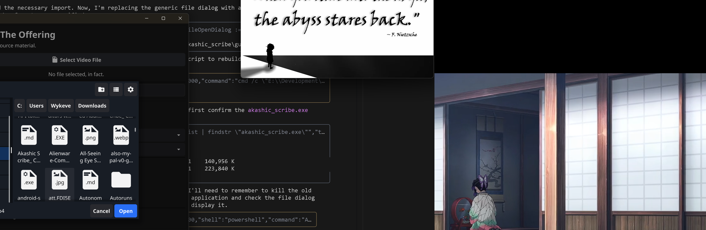

# Akashic Scribe
**VoidCat RDC Digital Scriptorium**

> A powerful desktop application for video transcription, translation, and dubbing


## Overview

Akashic Scribe is a cross-platform desktop application developed by **VoidCat RDC** that revolutionizes the process of transcribing, translating, and dubbing video content. With an intuitive three-step workflow, users can seamlessly process videos from local files or URLs, configure advanced language settings, and generate professional-quality subtitles and dubbed audio.

### Key Features

- **🎬 Video Transcription**: Automatically extract text from video content with AI precision
- **🌐 Translation**: Convert transcribed text to multiple target languages
- **📝 Subtitle Generation**: Create customizable subtitles in original and translated languages
- **🎙️ Audio Dubbing**: Generate natural-sounding dubbed audio using advanced AI voice models
- **🖥️ User-Friendly Interface**: Simple three-step workflow for all operations
- **⚡ Cross-Platform**: Runs on Windows, macOS, and Linux
- **🔧 Extensible**: Plugin architecture for custom functionality

## Screenshots



*More screenshots available in the [User Manual](docs/user-guide/index.md)*

## Quick Start

```bash
# Clone the repository
git clone https://github.com/sorrowscry86/akashic-scribe.git

# Navigate to the project directory
cd akashic-scribe/akashic_scribe

# Install dependencies
go mod tidy

# Run the application
go run .
```

### Three-Step Workflow

1. **📁 Input**: Select a local video file or enter a URL
2. **⚙️ Configure**: Choose source/target languages and output options
3. **🚀 Execute**: Process the video and view results

## Documentation

| Document | Description |
|----------|-------------|
| [📋 Installation Guide](docs/installation.md) | Complete setup instructions for all platforms |
| [👥 User Manual](docs/user-guide/index.md) | Comprehensive user guide |
| [⚡ Developer Guide](docs/developer-guide/index.md) | Development setup and contribution guidelines |
| [🔧 API Documentation](docs/api/index.md) | Technical API reference |
| [📝 Changelog](CHANGELOG.md) | Version history and updates |

## System Requirements

- **Operating System**: Windows 10/11, macOS 10.14+, or Linux (X11/Wayland)
- **RAM**: 4GB minimum, 8GB recommended
- **Disk Space**: 500MB for application + processing space
- **Internet**: Required for URL-based video processing

## Development

Akashic Scribe is built with **Go** and the **Fyne toolkit**, following VoidCat RDC's excellence standards.

### Building from Source

```bash
# Navigate to the project directory
cd akashic_scribe

# Build for current platform
go build -o akashic_scribe .

# Cross-compilation examples
GOOS=windows GOARCH=amd64 go build -o akashic_scribe.exe .
GOOS=darwin GOARCH=amd64 go build -o akashic_scribe .
GOOS=linux GOARCH=amd64 go build -o akashic_scribe .
```

### Running Tests

```bash
# Run all tests
go test ./...

# Run with coverage
go test -cover ./...

# Verbose output
go test -v ./...
```

## Architecture

```
akashic_scribe/
├── main.go              # Application entry point
├── gui/                 # User interface components
│   ├── layout.go        # UI layout and widgets
│   ├── state.go         # State management
│   ├── theme.go         # Custom theming
│   └── engine.go        # GUI-Core interface
├── core/                # Business logic
│   ├── engine.go        # Core engine interface
│   ├── real_engine.go   # Production implementation
│   ├── mock_engine.go   # Testing implementation
│   └── options.go       # Configuration structure
└── assets/              # Static resources
    ├── icons/
    └── fonts/
```

## License

Distributed under the MIT License. See `LICENSE` for more information.

## Contributing

We welcome contributions! Please see our [Contributing Guidelines](docs/developer-guide/contributing.md) for details.

### Contributors

- **Lead Developer**: [@sorrowscry86](https://github.com/sorrowscry86)
- **Organization**: VoidCat RDC

## Acknowledgments

- [Fyne Toolkit](https://fyne.io/) - Cross-platform GUI framework
- [Go Programming Language](https://golang.org/) - Core development language
- VoidCat RDC Team - Project leadership and vision

---

## 📞 Support & Contact

- **GitHub Issues**: [Report bugs or request features](https://github.com/sorrowscry86/akashic-scribe/issues)
- **Discussions**: [Community discussions and Q&A](https://github.com/sorrowscry86/akashic-scribe/discussions)
- **Developer**: [@sorrowscry86](https://github.com/sorrowscry86)
- **Project**: VoidCat RDC - Akashic Scribe
- **Contact**: Wykeve Freeman (Sorrow Eternal) - SorrowsCry86@voidcat.org
- **Organization**: VoidCat RDC
- **Support Development**: CashApp $WykeveTF

---

<div align="center">

**© 2024 VoidCat RDC, LLC. All rights reserved.**

*Excellence in Digital Innovation*

</div>